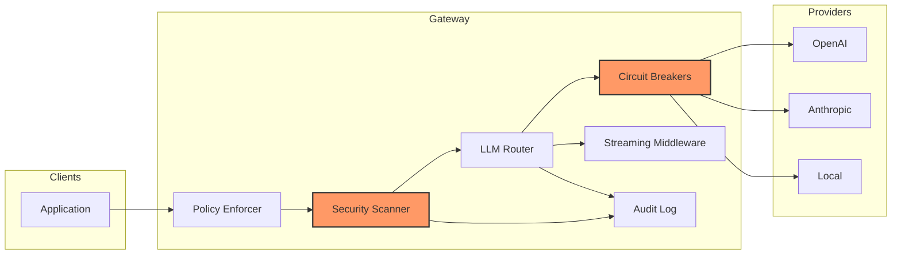

# Model-Agnostic LLM Gateway & Policy Guardrail Proxy

> Enterprise-grade API proxy gateway that sits between applications and multiple upstream AI providers (OpenAI, Anthropic, local models). Evaluates prompts against security policies, routes dynamically by cost/latency, and sanitizes streaming output.



## Why TypeScript?

This project uses compile-time types to prevent runtime security incidents in an LLM proxy path:

- **Polymorphic provider abstraction** (`BaseModelProvider` → `OpenAIProvider`, `AnthropicProvider`, `LocalProvider`) means adding a new provider requires extending a typed class, not rewriting routing logic. The router handles type-safety across varying response shapes.
- **Template literal types** for audit categories (`[SEVERITY] [CATEGORY] [ACTION] provider/model: message`) enforce log format correctness at compile time — an invalid audit category is a type error, not a runtime format bug.
- **Discriminated union** for `StreamChunk` (`{ content, done, usage? }`) ensures streaming callers handle completion correctly.
- **Zod schemas** validate every external input (ChatRequest, provider responses) — malformed API responses from upstream providers are caught before they propagate.

In short: if an upstream provider changes their response format, Zod catches it at runtime AND types document exactly what's expected.

## Architecture

```
src/
├── index.ts                    # Entry point, factory functions
├── types/
│   ├── provider.ts             # Zod schemas for ChatRequest/ChatResponse
│   └── audit.ts                # Template literal types for audit logs
├── providers/
│   ├── base.ts                 # Abstract BaseModelProvider
│   ├── openai.ts               # OpenAI provider implementation
│   ├── anthropic.ts            # Anthropic provider implementation
│   └── local.ts                # Local/Ollama provider implementation
├── gateway/
│   ├── router.ts               # LLM router with priority fallback
│   ├── circuit-breaker.ts      # Circuit breaker with half-open recovery
│   └── streaming.ts            # TokenCounter, stream transformers
└── security/
    ├── scanner.ts              # PII/credential/prohibited content scanner
    └── policy.ts               # Policy enforcer with configurable rules
```

### Provider Polymorphism

All providers extend `BaseModelProvider`, enforcing a consistent interface:

```typescript
abstract class BaseModelProvider {
  abstract readonly name: string
  abstract chat(request: ChatRequest): Promise<ProviderResponse>
  abstract chatStream(request: ChatRequest, onChunk: (chunk: StreamChunk) => void): Promise<void>
}
```

Adding a new provider means implementing two methods — the router handles everything else.

### Circuit Breaker Pattern

Each provider gets a `CircuitBreaker`. After N consecutive failures, the breaker opens and subsequent requests skip to the next provider. After a configurable timeout, it transitions to `half-open` and allows a probe. If the probe succeeds, it resets; if it fails, it re-opens.

```
States: closed → (N failures) → open → (timeout) → half-open → (success) → closed
                                                         ↓ (failure) → open
```

### Security Scanner

The `scanText()` function detects four classes of content inline:

| Class | Examples | Pattern |
|-------|----------|---------|
| API Keys | OpenAI `sk-...`, AWS `AKIA...`, GitHub `ghp_...`, JWT tokens | Length + prefix heuristics |
| PII | SSNs, emails, IP addresses, credit card numbers | Standard regex patterns |
| Prohibited Content | Prompt injection (`ignore all previous...`) | Anti-prompt-injection patterns |

The scanner runs **on each streaming chunk** without breaking the stream using `TransformStream`.

### Audit Log (Template Literal Types)

Log entries use template literal types to enforce format:

```typescript
type AuditLogFormat<C extends AuditCategory, A extends AuditAction> =
  `[${Severity}] [${C}] [${A}] ${string}`
```

Categories and actions are enum-like string unions — invalid combinations are compile errors.

## Getting Started

```bash
# Install
npm install

# Type-check
npm run typecheck

# Run tests
npm test
```

Configure providers via environment variables:

```bash
export OPENAI_API_KEY=sk-...
export ANTHROPIC_API_KEY=sk-ant-...
```

## CI/CD

Every push runs `tsc --noEmit --strict` and `vitest`:

```yaml
# .github/workflows/ci.yml
jobs:
  typecheck-and-test:
    runs-on: ubuntu-latest
    steps:
      - uses: actions/checkout@v4
      - uses: actions/setup-node@v4
      - run: npm ci
      - run: npm run typecheck
      - run: npm test
```

## Stack

- **TypeScript 5.9** — strict mode, `noUncheckedIndexedAccess`, `exactOptionalPropertyTypes`
- **Zod** — runtime validation at every external boundary
- **Vitest** — async integration tests
- **Web Streams API** — `TransformStream` for streaming middleware
- **Node.js 20+** — ESM modules, native fetch


